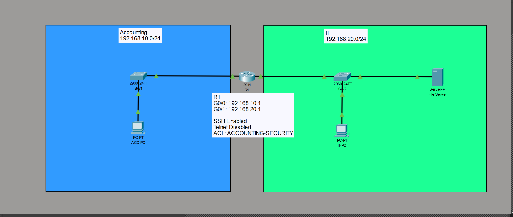
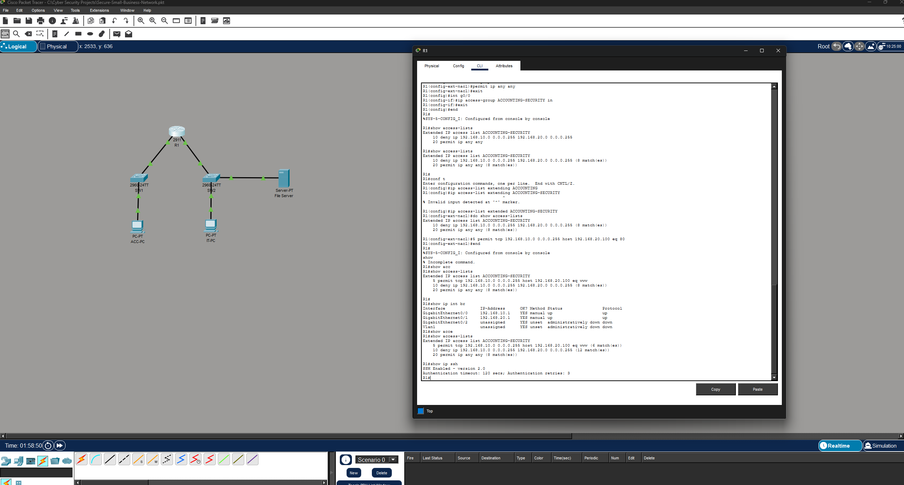
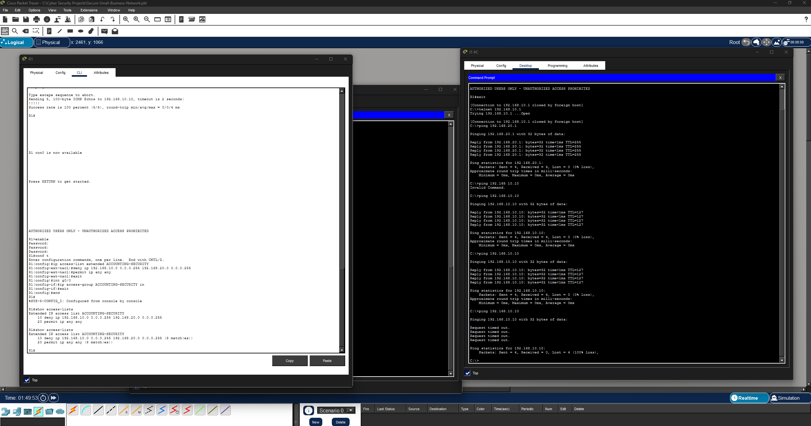
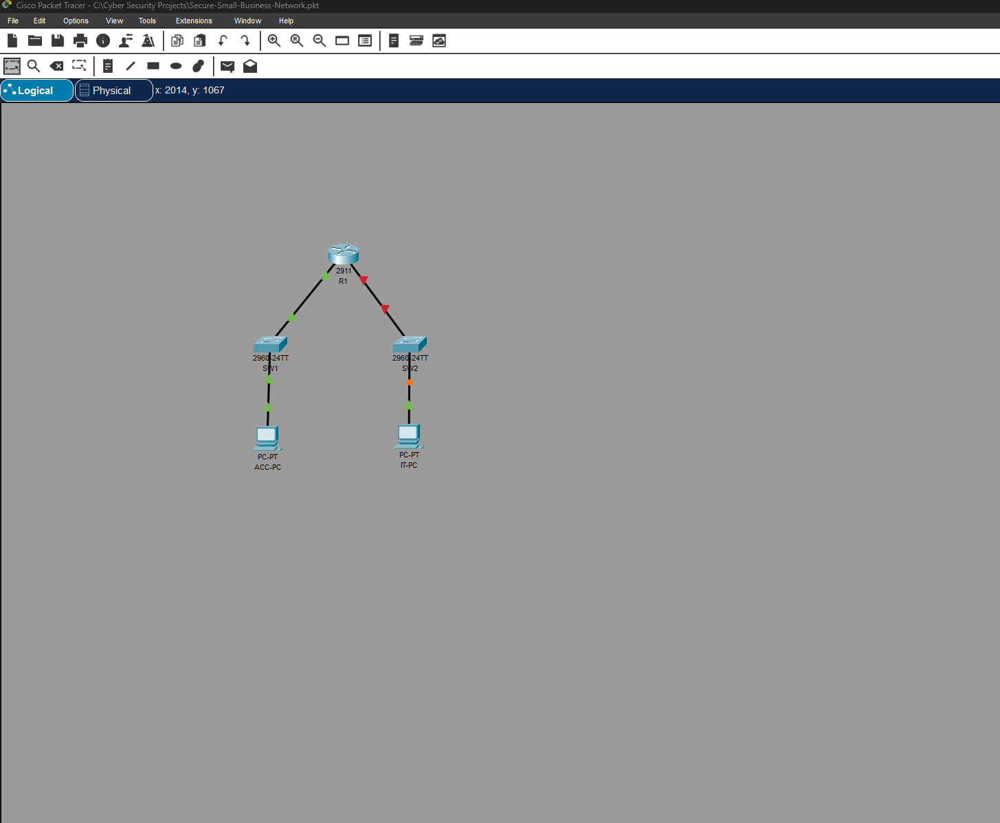

# Secure Small Business Network

A Cisco Packet Tracer project demonstrating the design and security of a small business network with separate Accounting and IT networks.

The project focuses on basic network segmentation, router configuration, access control lists (ACLs), SSH remote management, Telnet restriction, and connectivity testing.

## Network Topology

The network is divided into two /24 networks:

- **Accounting:** 192.168.10.0/24
- **IT:** 192.168.20.0/24

A Cisco 2911 router connects the two networks.

### Router Interfaces

| Interface | IP Address | Network |
|---|---|---|
| G0/0 | 192.168.10.1 | Accounting |
| G0/1 | 192.168.20.1 | IT |

## Security Configuration

Several security controls were implemented on the router.

### SSH Remote Management

SSH was configured to provide encrypted remote administrative access to the router.

Telnet access was disabled so that remote management credentials and traffic are not transmitted using the insecure Telnet protocol.

### Access Control List

An extended ACL named:

`ACCOUNTING-SECURITY`

was configured to control traffic originating from the Accounting network.

The ACL was used to restrict selected traffic between:

- `192.168.10.0/24` — Accounting
- `192.168.20.0/24` — IT

The configuration was verified using Cisco IOS commands.

## Connectivity and ACL Testing

Connectivity tests were performed from end devices to verify that routing worked and that the ACL enforced the intended restrictions.

The testing demonstrated both successful communication and traffic being blocked when required by the security policy.

## SSH and Telnet Testing

Remote management security was tested from an endpoint.

SSH successfully connected to the router using:

`ssh -l admin 192.168.10.1`

A Telnet connection to the router was also attempted and was rejected, confirming that Telnet remote access was disabled.

## Technologies Used

- Cisco Packet Tracer
- Cisco IOS
- IPv4
- Routing
- Access Control Lists (ACLs)
- SSH
- Network segmentation
- Cisco 2911 Router
- Cisco 2960 Switches

## Skills Demonstrated

This project demonstrates practical experience with:

- Designing a basic network topology
- Configuring router interfaces
- Assigning IPv4 addresses and default gateways
- Connecting multiple LANs
- Configuring extended ACLs
- Applying ACLs to router interfaces
- Configuring secure SSH management
- Disabling insecure Telnet access
- Testing connectivity with ICMP
- Troubleshooting network connectivity
- Verifying Cisco IOS configurations

## Project Summary

This project simulates a small business environment where different departments are separated into their own networks and traffic between those networks is controlled using router security policies.

The goal was not only to establish connectivity, but also to apply basic network-hardening practices and verify that those controls worked as intended.
